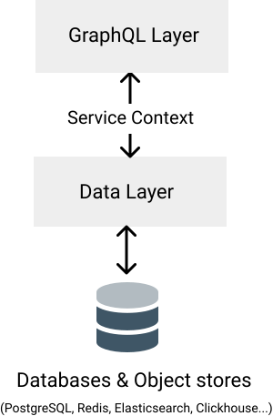

# Data Layer
This layer deals communicates with the GraphQL layer via a Service Context object.
It is responsible for interacting with databases and object stores.



## Services
In Potionx, we use the word "Service" to represent the functions that create, fetch, edit and delete models.
The GraphQL layer calls these services to response to GraphQL requests from the web alyer.

For example, here's an example of a User service similar to services generated by the [model generator](/generators/model):

```elixir
defmodule SomeProject.Users.UserService do
  alias Potionx.Context.Service
  alias SomeProject.Users.User
  alias SomeProject.Repo
  import Ecto.Query

  def count(%Service{} = ctx) do
    from(item in query(ctx), select: count(item.id))
    |> Repo.one!
  end

  def delete(%Service{} = ctx) do
    query(ctx)
    |> Repo.one
    |> case do
      nil -> {:error, "not_found"}
      entry ->
        entry
        |> Repo.delete
    end
  end

  def mutation(%Service{filters: %{id: id}} = ctx) when not is_nil(id) do
    query(ctx)
    |> Repo.one
    |> case do
      nil -> {:error, "not_found"}
      entry ->
        User.changeset(entry, ctx.changes)
        |> Repo.update
    end
  end
  def mutation(%Service{} = ctx) do
    %User{}
    |> User.changeset(ctx.changes)
    |> Repo.insert
  end

  def one(%Service{} = ctx) do
    query(ctx)
    |> Repo.one
  end

  def query(%Service{} = ctx) do
    User
    |> where(
      ^(
        ctx.filters
        |> Map.to_list
      )
    )
  end
  def query(q, _args), do: q
end

```
