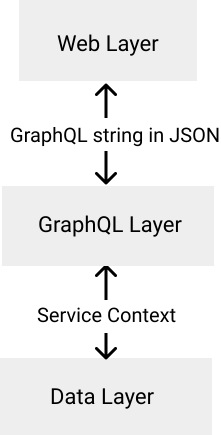

# GraphQL Layer
This layer is a set of opinonated defaults applied to [Absinthe](https://github.com/absinthe-graphql/absinthe).
It receives JSON from the web layer containing GraphQL queries and transforms them into Service Context requests to the data layer.



## Default Middleware
By default, Potionx adds the following middleware to `schema.ex`:

### Potionx.Middleware.Mutation
This normalizes the results of mutations to return a map containing the result assigned to the node property:

For example, a user mutation would return:
```elixir
{:ok, %{node: %SomeProject.Users.User{}}}
```

### Potionx.Middleware.ServiceContext
This converts incoming variables to a `Potionx.Context.Service` struct.

For example: 
```elixir
%{
  changes: some_changes,
  filters: some_filters
}
```
gets converted to:
```elixir
%Potionx.Context.Service{
  changes: some_changes,
  filters: some_filters
}
```

### Potionx.Middleware.Scope
This middleware uses the data layer's `repo.ex` to set variables required for user/organization multitenancy based on the ideas from [Ecto's Multi tenancy with foreign keys](https://hexdocs.pm/ecto/multi-tenancy-with-foreign-keys.html)

### Potionx.Middleware.UserRequired
Requires that a user be in the context unless the query is added as an exception.

## Default Types
Potionx adds the following types by default which are used by the [generators](/docs/generators.html#generating-backend-and-frontend-scaffold-code-for-data-models-ecto-schemas):

```elixir
 enum :sort_order do
    value :asc
    value :desc
  end
  object :error do
    field :field, :string
    field :message, :string
  end
  scalar :global_id do
    parse fn
      %{value: v}, ctx ->
        case v do
          s when is_binary(s) ->
            Absinthe.Relay.Node.from_global_id(s, __MODULE__)
            |> case do
              {:ok, %{id: id}} -> {:ok, id}
              err -> err
            end
          default ->
            {:ok, default}
        end
      _, _ ->
        {:ok, nil}
    end

    serialize fn input ->
      input
    end
  end
```

## File and Folder Naming Conventions
Potionx names GraphQL files for models as follows:

```bash
MODEL_mutations.ex # model mutation config
MODEL_queries.ex # queries for a single or many models
MODEL_types.ex # types related to the model
```

For example, the user files generated by default are:
```bash
user_mutations.ex
user_queries.ex
user_types.ex
```

## Permissions
Potionx includes a `Potionx.Middleware.RolesAuthorization` module to handle authorization at the GraphQL level.
It authorizes requests based on roles in the `Potionx.Service.Context` passed in. It is set to `:admin` for all mutations and queries by default.

For example:
```elixir
defmodule SomeProjectGraphQl.Schema.UserQueries do
  use Absinthe.Schema.Notation
  use Absinthe.Relay.Schema.Notation, :modern

  object :user_queries do
    connection field :user_collection, node_type: :user do
      arg :filters, :user_filters
      arg :order, type: :sort_order, default_value: :asc
      middleware Potionx.Middleware.RolesAuthorization, [roles: [:admin]]
      resolve &SomeProjectGraphQl.Resolver.User.collection/2
    end

    field :user_single, type: :user do
      arg :filters, :user_filters_single
      middleware Potionx.Middleware.RolesAuthorization, [roles: [:admin]]
      resolve &SomeProjectGraphQl.Resolver.User.one/2
    end
  end
end
```

## Collections and Relay
By default collection queries (requests several models) adhere to the [Relay specification](https://hexdocs.pm/absinthe/relay.html). Offset pagination is used at the moment but will be swapped to [cursor pagination](https://use-the-index-luke.com/blog/2013-07/pagination-done-the-postgresql-way) soon. 