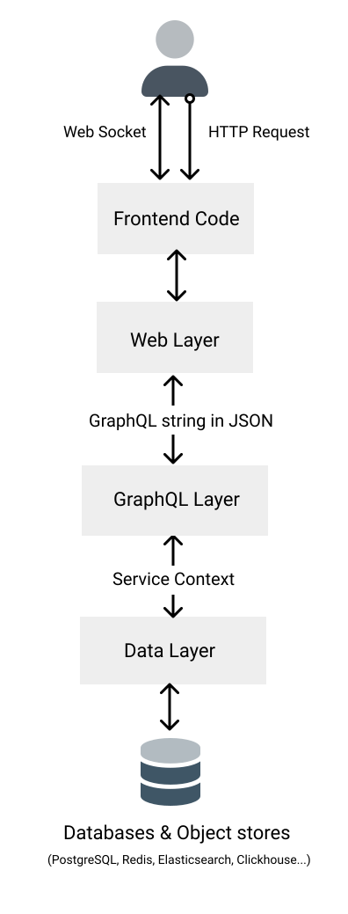

# Architecture and File Structure

## Architecture
Here's a general overview of the architecture Potionx uses:


Details about each layer can be found in the other sections in this area.

## File Structure
Here's an overview of what a Potionx project looks like. It's what a project directory contains after running the Potionx project generator with `mix potionx.new some_project_name`.

```bash
.
├─ config # backend config
│  ├─ config.exs # config for all envs goes here
│  ├─ dev.exs # general dev-related config goes here
│  ├─ dev.secret.exs # local database and auth provider config go here
│  ├─ prod.exs # general production-related config goes here
│  ├─ runtime.exs
│  │  # deployment config goes here, mostly loads env variables at runtime
│  ├─ test.exs # general dev-related config goes here
│  └─ test.secret.exs # test database and auth provider config goes here
├─ deps # elixir deps
├─ frontend # frontend apps live here
│  └─ admin
│     ├─ node_modules
│     ├─ public 
│     │  # convenience directory to serve assets via URL as opposed to
│     │  # imported into code
│     ├─ src
│     │   ├─ assets # assets meant to be imported into code
│     │   │  └─ logo.png
│     │   ├─ components 
│     │   │  # general app components, by default contains components copied 
│     │   │  # from the UI package necessary for this theme. 
│     │   │  # See UI docs for more information about there components.
│     │   │  ├─ AdminBody
│     │   │  ├─ AdminFooter
│     │   │  ├─ AdminHeader
│     │   │  └─ # ...many more
│     │   ├─ routes
│     │   │  ├─ RouteHome # Code for the home page
│     │   │  ├─ RouteLogin # Code for the login page
│     │   │  ├─ RouteLoginError # Code loaded when a sign in attempt fails
│     │   │  ├─ RouteUserEdit # Code to edit a user
│     │   │  ├─ RouteUserList # Code that shows a list of the app's users
│     │   │  ├─ index.ts # Global Route setup
│     │   │  └─ routeNames.ts
│     │   │  # A Typescript enum containing all the app's route names
│     │   ├─ App.tsx # Root app Vue component
│     │   ├─ main.css # main app css file for general styling imports/config
│     │   ├─ main.ts # main app entry point
│     │   ├─ useAdminNavPrimary.ts # Primary app navigation
│     │   └─ useAdminNavSecondary.ts # Secondary navigation (account/log out)
│     ├─ .gitignore
│     ├─ package.json
│     ├─ postcss.config.js
│     ├─ tailwind.config.js
│     ├─ tsconfig.json
│     └─ vite.config.ts
├─ lib
│  ├─ some_project_name # The main data layer
│  │   ├─ user_identities
│  │   │  ├─ user_identity.ex # user_identity model used by Potinx Auth
│  │   │  ├─ user_identity_mock.ex # mock of user_identity for testing purposes
│  │   │  └─ user_identity_service.ex
│  │   │  # the service used to create/query/edit user identities
│  │   ├─ users
│  │   │  ├─ user.ex
│  │   │  │ # user model used by Potionx Auth and used in the
│  │   │  │ # admin theme by default
│  │   │  ├─ user_mock.ex # mock of user for testing purposes
│  │   │  └─ user_service.ex # the service used to create/query/edit users
│  │   ├─ application.ex # main application entry point
│  │   ├─ release.ex # release/deployment specific configuration. 
│  │   │  # Creates default user if they don't exist.
│  │   └─ repo.ex
│  │   # General database handler config.
│  │   # Used to set up scoping for models.
│  ├─ some_project_name_graphql # The GraphQL layer
│  │   ├─ resolvers 
│  │   │  ├─ user_identity_resolver.ex # the user_identity GraphQL resolver
│  │   │  └─ user_resolver.ex # the user GraphQL resolver
│  │   ├─ schemas
│  │   │  ├─ user
│  │   │  │  ├─ user_mutations.ex # the user mutations (create, edit, delete)
│  │   │  │  ├─ user_queries.ex # the user queries (one user, many users)
│  │   │  │  └─ user_types.ex # the default user types needed by GraphQL
│  │   │  └─ user_identity
│  │   │     └─ user_identity_types.ex
│  │   │     # the default user_identity types needed by GraphQL
│  │   └─ schema.ex
│  ├─ some_project_name_web
│  │   ├─ channels
│  │       └─ user_socket.ex # the main websocket config file
│  │   ├─ controllers
│  │   │  ├─ app_controller.ex # Serves the based frontend code
│  │   │  ├─ auth_controller.ex
│  │   │  │ # Deletes and renews authentication tokens for users
│  │   │  │ # Note: the create function in here is not used.
│  │   │  ├─ authorization_controller.ex
│  │   │  │ # handles initial creation of access tokens (logging in) via
│  │   │  │ # third parties like Google, Microsoft..
│  │   │  └─ page_controller.ex # serves HTML, not currently used
│  │   ├─ templates
│  │   │  ├─ app
│  │   │  │  └─ index.html.eex # Base app markup needed by the frontend apps
│  │   │  ├─ authorization
│  │   │  │  └─ refresh.html.eex
│  │   │  │  # used to refresh the page after a user logs so cookies are properly set
│  │   │  ├─ layout
│  │   │  │  └─ app.html.eex # markup for general app layout (head, body)
│  │   │  └─ page
│  │   │     └─ index.html.eex # not used
│  │   ├─ views # used to set convenience or computed functions for use in templates
│  │   │  ├─ app_view.ex
│  │   │  ├─ authorization_view.ex
│  │   │  ├─ error_helpers.ex
│  │   │  ├─ error_view.ex
│  │   │  ├─ layout_view.ex
│  │   │  └─ page_view.ex
│  │   ├─ endpoint.ex # the root module for HTTP/Socket communication 
│  │   ├─ gettext.ex # the root internalization module
│  │   ├─ router.ex # the app routing configuration
│  │   └─ telemetry.ex
│  │   # Module that sets up telemetry for the app. 
│  │   # The data can be visualized in LiveDashboard.
│  ├─ some_project_name.ex # root data layer module, mostly empty
│  └─ some_project_name_web.ex
│  # root web module, contains Phoenix-related code required by code in the web module
├─ node_modules
├─ priv
│  ├─ gettext # translations folder
│  │  ├─ en
│  │  │  └─ errors.po # translation files output by template
│  │  └─ errors.pot # translation file template
│  ├─ repo
│  │  ├─ migrations
│  │  │  ├─ DATE_create_users.exs # default user migration generated
│  │  │  └─ DATE_create_user_identities.exs
│  │  │  # default user_identities migration generated
│  │  └─ seeds.exs # Best place to put your own database seeding.
├─ shared # shared frontend/backend code
│  ├─ src
│  │  ├─ models
│  │  │  ├─ Users
│  │  │  │  └ User
│  │  │  │    ├ user.json # user schema to be used in frontend forms
│  │  │  │    ├ user.mock.json # mock user to be used in frontend tests
│  │  │  │    ├ userCollection.gql # auto-generated default user collection query
│  │  │  │    ├ userCollection.gql.ts
│  │  │  │    │ # Typescript-friendly import of user collection query
│  │  │  │    │ # for use in frontend
│  │  │  │    ├ userDelete.gql # auto-generated default user delete query
│  │  │  │    ├ userDelete.gql.ts 
│  │  │  │    │ # Typescript-friendly import of user delete query
│  │  │  │    │ # for use in frontend
│  │  │  │    ├ userMutation.gql # auto-generated default user mutation query
│  │  │  │    ├ userMutation.gql.ts
│  │  │  │    │ # Typescript-friendly import of user mutation query
│  │  │  │    │ # for use in frontend
│  │  │  │    ├ userSingle.gql # auto-generated default single user query
│  │  │  │    └ userSingle.gql.ts
│  │  │  │    # Typescript-friendly import of single user query for use in frontend
│  │  │  └─ UserIdentities
│  │  │      └ User
│  │  │        ├ userIdentity.json
│  │  │        │ # user identity schema to be used in frontend forms
│  │  │        └ userIdentity.mock.json
│  │  │        # mock user_identity to be used in frontend tests
│  │  ├─ gql.ts # lightweight gql file to get proper linting in VS Code
│  │  ├─ signIn.ts # default user sign in function
│  │  ├─ signOut.ts # default user sign out function
│  │  └─ types.d.ts # global GraphQL types based on your Absinthe Schema
│  ├─ .gitignore
│  ├─ codegen.yml # config for GraphQL types generation
│  └─ package.json 
├─ test
│  ├─ some_project_graphql
│  │  ├─ mutations
│  │  │   └─ user_mutations_test.exs # test for GraphQL user mutations
│  │  └─ queries
│  │      └─ user_queries_test.exs # test for GraphQL user queries
│  ├─ some_project_web
│  │  ├─ channels (empty)
│  │  ├─ controllers (empty)
│  │  └─ views
│  │      ├─ error_view_test.exs
│  │      ├─ layout_view_test.exs
│  │      └─ page_view_test.exs
│  ├─ support # default Phoenix test helpers
│  │  ├─ channel_case.ex
│  │  ├─ conn_case.ex
│  │  └─ data_case.ex
│  └─ test_helper.exs # starts modules needed for tests like ExUnit
├─ .gitignore
├─ build.sh # build script for Render.com
├─ Dockerfile # Dockerfile that will eventually be used for Kubernetes recipes
├─ mix.exs # App Elixir dependencies
├─ package.json # App Javascript dependencies
└─ README.md
```
