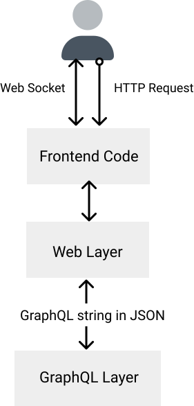

# Web Layer
This layer receives HTTP requests and manages web sockets. It mostly contains [Phoenix's](https://www.phoenixframework.org/) defaults. It communicates with the GraphQL layer via HTTP and Websocket JSON requests.




## Default Routes and Plugs
The following default routes and plugs are added:

```elixir
  pipeline :graphql do
    plug :accepts, ["json"]
    plug Potionx.Plug.ServiceContext
    plug Potionx.Plug.Auth,
      session_optional: true,
      session_service: SomeProject.Sessions.SessionService
    if Mix.env() in [:prod, :test] do
      plug Potionx.Plug.MaybeDisableIntrospection, [roles: [:admin]]
    end
    plug Potionx.Plug.Absinthe
  end

  pipeline :auth_callback do
    plug :accepts, ["json"]
    plug Potionx.Plug.ServiceContext
    plug Potionx.Plug.Auth,
      session_service: SomeProject.Sessions.SessionService
  end

  scope "/graphql/v1" do
    pipe_through :graphql

    forward "/", Absinthe.Plug,
      before_send: {Potionx.Auth.Resolvers, :before_send},
      schema: SomeProjectGraphQl.Schema
  end


  scope "/api/v1", as: :api_v1 do
    pipe_through :auth_callback
    get "/auth/:provider/callback",
      Potionx.Auth.Resolvers,
      [
        session_service: SomeProject.Sessions.SessionService
      ]
    post "/auth/:provider/callback",
      Potionx.Auth.Resolvers,
      [
        session_service: SomeProject.Sessions.SessionService
      ]
  end

```