# components

All components are styled with tailwindcss and built to easily be edited to fit your projects needs. 

<!-- ## AccountToggle

Used to display the current user and to toggle the secondary navigation for account related links and buttons (account, settings, log out, etc.).

#### Importing AccountToggle
```tsx
import AccountToggle from "components/AccountToggle/AccountToggle";
```

#### Using AccountToggle
```tsx
<AccountToggle>
  //
  // Slot
  //
</AccountToggle>
```
<br />
<br /> -->

## AdminBody

Used to apply padding to match with the [AdminHeader](/ui/components.html#adminheader) Component.

#### Importing AdminBody
```tsx
import AdminBody from "components/AdminBody/AdminBody";
```

#### Using AdminBody
```tsx
<AdminBody>
  //
  // Slot
  //
</AdminBody>
```
<br />
<br />

## AdminFooter

Used as a mobile footer navigation. Nest it within the [AdminMain](/ui/components.html#adminmain) component for proper spacing, and use the [BtnMobileMenu](/ui/components.html#btnmobilemenu) component for matching prestyled buttons.

#### Importing AdminFooter
```tsx
import AdminFooter from "components/AdminFooter/AdminFooter";
```

#### Using AdminFooter
```tsx
<AdminFooter>
  //
  // Slot
  //
</AdminFooter>
```
<br />

#### AdminFooterProps

**hidden:** `boolean` `optional` \
Hide the toggle menu button

#### Demo

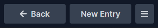

<br />
<br />

## AdminForm

A form component.

#### Importing AdminForm
```tsx
import AdminForm from "components/AdminForm/AdminForm";
```

#### Using AdminForm
```tsx
<AdminForm submit={submitFunction}>
  //
  // Slot
  //
</AdminForm>
```
<br />

#### AdminFormProps

**onSubmit:** `function` `required` \
The form submit action

<br />
<br />

## AdminHeader

Used as a header within [AdminMain](/ui/components.html#adminmain) and shares common padding with [AdminBody](/ui/components.html#adminbody). Other related components are [AdminHeaderBtnWrap](/ui/components.html#adminheaderbtnwrap), [AdminHeaderTitle](/ui/components.html#adminheadertitle), and [AdminHeaderSubtitle](/ui/components.html#adminheadersubtitle).

#### Importing AdminHeader
```tsx
import AdminHeader from "components/AdminHeader/AdminHeader";
```

#### Using AdminHeader
```tsx
<AdminHeader
   v-slots={{btns: () => <ExampleComponent />}} // Used for the button slot
>
  //
  // Default slot
  //
</AdminHeader>
```
#### Demo

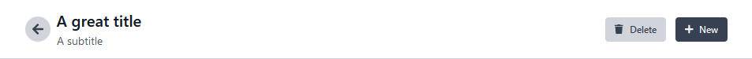

<br />
<br />

## AdminHeaderBtnWrap

Used to wrap the [Btn](/ui/components.html#btn) component within [AdminHeader](/ui/components.html#adminheader) (or any variation of [Btn](/ui/components.html#btn), such as [BtnSmall](/ui/components.html#btnsmall)).

#### Importing AdminHeaderBtnWrap
```tsx
import AdminHeaderBtnWrap from "components/AdminHeaderBtnWrap/AdminHeaderBtnWrap";
```

#### Using AdminHeaderBtnWrap
```tsx
<AdminHeaderBtnWrap>
  //
  // Slot
  //
</AdminHeaderBtnWrap>
```
<br />

#### AdminHeaderBtnWrapProps

**hidden:** `boolean` `optional` \
Hide this button on mobile

<br />
<br />

## AdminHeaderSubtitle
Used as a prestyle [AdminHeader](/ui/components.html#adminheader) subtitle.

#### Importing AdminHeaderSubtitle
```tsx
import AdminHeaderSubtitle from "components/AdminHeaderSubtitle/AdminHeaderSubtitle";
```

#### Using AdminHeaderSubtitle
```tsx
<AdminHeaderSubtitle>
  Subtitle Label
</AdminHeaderSubtitle>
```
<br />
<br />

## AdminHeaderTitle
Used as a prestyle [AdminHeader](/ui/components.html#adminheader) title.

#### Importing AdminHeaderTitle
```tsx
import AdminHeaderTitle from "components/AdminHeaderTitle/AdminHeaderTitle";
```

#### Using AdminHeaderTitle
```tsx
<AdminHeaderTitle>
  Title Label
</AdminHeaderTitle>
```
<br />
<br />

## AdminMain
Used to nest [AdminFooter](/ui/components.html#adminfooter) with appropriate spacing for mobile.

#### Importing AdminMain
```tsx
import AdminMain from "components/AdminMain/AdminMain";
```

#### Using AdminMain
```tsx
<AdminMain>
  //
  // Slot
  //
</AdminMain>
```
<br />
<br />

## AdminShell
Used as a wrapper component within your `App.tsx` file to apply proper layout styling. It's direct children components are [AdminSidebar](/ui/components.html#adminsidebar) and [AdminMain](/ui/components.html#adminmain).

#### Importing AdminShell
```tsx
import AdminShell from "components/AdminShell/AdminShell";
```

#### Using AdminShell
```tsx
<AdminShell>
  //
  // Slot
  //
</AdminShell>
```
<br />
<br />

## AdminSidebar
Used as the admin navigation sidebar.

#### Importing AdminSidebar
```tsx
import AdminSidebar from "components/AdminSidebar/AdminSidebar";
```

#### Using AdminSidebar
```tsx
<AdminSidebar>
  //
  // Slot
  //
</AdminSidebar>
```
<br />
<br />

## Btn
An unstyled link (or button) component with props to be used as a base for other link components. It can also be used within your project if you want to apply custom styling to an individual link. 

Depending on which props you use, this component will either be an `<a>`, a `<router-link>`, or a `<button>` element.

#### Importing Btn
```tsx
import Btn from "components/Btn/Btn";
```

#### Using Btn
```tsx
<Btn
  icon={faArrowRight}
  label="Add New"
  reverse={true}
  to={{name: routeNames.edit}}
>
  //
  // Slot
  //
</Btn>
```
<br />

#### BtnProps
**click:** `function` `Optional` \
Passing down a click function will make this component a `<button>` element
<br/>

**disabled:** `Boolean` `Optional` \
Makes it non-clickable and opaque
<br/>

**icon:** `FontAwesomeIcon` `Object` `Optional` \
A FontAwesomeIcon icon
<br/>

**id:** `String` `Optional` \
Component Id
<br/>

**label:** `String` `Optional`\
The component text field
<br/>

**reverse:** `Boolean` `Optional`\
Reverse the order or the icon and label 
<br/>

**to:** `RouteLocationRaw` `Optional`\
Passing down a route will make this component a `<router-link>` element 
<br/>

**toExternal:** `String` `Optional`\
Passing down an external link will make this an `<a>` element that opens a new tab 
<br/>

**type:** `String` `Optional` \
Type applies to a `<button>` element when using the click prop 
<br/>
<br/>

We've created multiple prestyled Btn components to speed up the development process. They all share props with the [Btn](/ui/components.html#btn) Component, although some only utilize a few.

### BtnIcon

A lighter version of the [Btn](/ui/components.html#btn) component that displays only an icon.

#### Importing BtnIcon
```tsx
import BtnIcon from "components/Btn/BtnIcon";
```

#### Demo


### BtnLogin

A button that is styled for the login route.

#### Importing BtnLogin
```tsx
import BtnLogin from "components/Btn/BtnLogin";
```

#### Demo

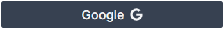

### BtnIconMobileMenu

An icon only button that is styled like the menu toggle button in the [Menu](/ui/components.html#menu) component.

#### Importing BtnIconMobileMenu
```tsx
import BtnIconMobileMenu from "components/Btn/BtnIconMobileMenu";
```

#### Demo

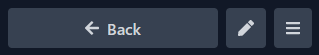

### BtnMobileMenu

A button that is styled to match the menu toggle button in the [Menu](/ui/components.html#menu) component.

#### Importing BtnMobileMenu
```tsx
import BtnMobileMenu from "components/Btn/BtnMobileMenu";
```

#### Demo


### BtnPrimary

A styled button to be used as the primary button.

#### Importing BtnPrimary
```tsx
import BtnPrimary from "components/Btn/BtnPrimary";
```

#### Demo

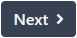

### BtnSecondary

A styled button to be used as the secondary button, in contrast with the primary button.

#### Importing BtnSecondary
```tsx
import BtnSecondary from "components/Btn/BtnSecondary";
```

#### Demo

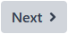

### BtnSmall

A smaller version of [Btn](/ui/components.html#btn).

#### Importing BtnSmall
```tsx
import BtnSmall from "components/Btn/BtnSmall";
```

### BtnSmallPrimary

A smaller version of [BtnPrimary](/ui/components.html#btnprimary).

#### Importing BtnSmallPrimary
```tsx
import BtnSmallPrimary from "components/Btn/BtnSmallPrimary";
```

#### Demo

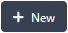

### BtnSmallSecondary

A smaller version of [BtnSecondary](/ui/components.html#btnsecondary).

#### Importing BtnSmallSecondary
```tsx
import BtnSmallSecondary from "components/Btn/BtnSmallSecondary";
```

#### Demo

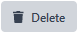

### BtnSubmit

A submit button to be used with forms.

#### Importing BtnSubmit
```tsx
import BtnSubmit from "components/Btn/BtnSubmit";
```

#### Demo


<br />
<br />

## Dropdown
A dropdown component.

#### Importing Dropdown
```tsx
import Dropdown from "components/Dropdown/Dropdown";
```

#### Using Dropdown
```tsx
<Dropdown>
  //
  // Slot
  //
</Dropdown>
```
<br />

#### Demo

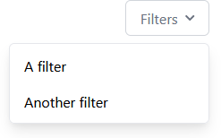

<br />
<br />

## FieldCheckbox
A checkbox component used for forms.

#### Importing FieldCheckbox
```tsx
import FieldCheckbox from "components/FieldCheckbox/FieldCheckbox";
```

#### Using FieldCheckbox
```tsx
<FieldCheckbox
  label="Teams"
  name="teams"
  options=[
    {label: "Red", value: "red"},
    {label: "Blue", value: "blue"}
  ]
  val={'red'}
/>
```
<br />

#### FieldCheckboxProps

**label:** `String` `Optional` \
Checkbox label
<br />

**name:** `String` `Required` \
Checkbox name
<br />

**options:** `FieldCheckboxOptionProps` `Array` `Required` \
Checkbox options
<br />

**unstyled:** `Boolean` `Optional` \
Removes component styling 
<br />
<br />

#### FieldCheckboxOptionProps
**label:** `String` `Required` \
Option label 
<br />

**value:** `Any` `Required` \
Option value

#### Demo

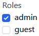

<br />
<br />

## FieldError
A styled error message for form fields.

#### Importing FieldError
```tsx
import FieldError from "components/FieldError/FieldError";
```

#### Using FieldError
```tsx
<FieldError>
  //
  // Slot
  //
</FieldError>
```

#### Demo

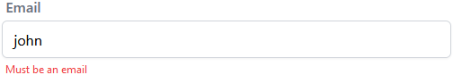

<br />
<br />

## FieldInput
A styled input component used for forms.

#### Importing FieldInput
```tsx
import FieldInput from "components/FieldInput/FieldInput";
```

#### Using FieldInput
```tsx
<FieldInput
  label="Email Address"
  name="email"
  type="email"
/>
```
<br />

#### FieldInputProps
**label:** `String` `Optional` \
Input label
<br />

**name:** `String` `Required` \
Input name
<br />

**type:** `String` `Default: "text"` `Optional` \
Input type
<br />

**unstyled:** `Boolean` `Optional` \
Removes component styling 
<br />

#### Demo

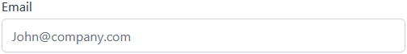

<br />
<br />

## FieldLabel
A label component meant to compliment form fields.

#### Importing FieldLabel
```tsx
import FieldLabel from "components/FieldLabel/FieldLabel";
```

#### Using FieldLabel
```tsx
<FieldLabel>
  //
  // Slot
  //
</FieldLabel>
```

#### Demo

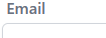

<br />
<br />

## FieldRadio
A styled radio component for forms.

#### Importing FieldRadio
```tsx
import FieldRadio from "components/FieldRadio/FieldRadio";
```

#### Using FieldRadio
```tsx
<FieldRadio
  label="Teams"
  name="teams"
  options=[
    {label: "Red", value: "red"},
    {label: "Blue", value: "blue"}
  ]
  val={'red'}
/>
```
<br />

#### FieldRadioProps

**label:** `String` `Optional` \
Radio label
<br />

**name:** `String` `Required` \
Radio name
<br />

**options:** `FieldRadioOptionProps` `Array` `Required` \
Radio options
<br />

**unstyled:** `Boolean` `Optional` \
Removes component styling 
<br />
<br />

#### FieldRadioOptionProps
**label:** `String` `Required` \
Option label 
<br />

**value:** `Any` `Required` \
Option value

#### Demo

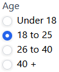

<br />
<br />

## FieldSelect
A styled select component for forms.

#### Importing FieldSelect
```tsx
import FieldSelect from "components/FieldSelect/FieldSelect";
```

#### Using FieldSelect
```tsx
<FieldSelect
  label="Experience"
  name="experience"
>
  <select value="1">1 Year</select>
  <select value="2 to 4">2 - 4 Years</select>
  <select value="5+">5 Years +</select>
</FieldSelect>
```
<br />

#### FieldSelectProps

**label:** `String` `Optional` \
Select label
<br />

**name:** `String` `Required` \
Select name
<br />

**unstyled:** `Boolean` `Optional` \
Removes component styling 

#### Demo

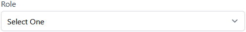

<br />
<br />

## FieldTextarea
A styled textarea component for forms.

#### Importing FieldTextarea
```tsx
import FieldTextarea from "components/FieldTextarea/FieldTextarea";
```

#### Using FieldTextarea
```tsx
<FieldTextarea 
  label="Comments"
  name="comments"
/>
```
<br />

#### FieldTextareaProps

**label:** `String` `Optional` \
Textarea label
<br />

**name:** `String` `Required` \
Textarea name
<br />

**unstyled:** `Boolean` `Optional` \
Removes component styling 

#### Demo

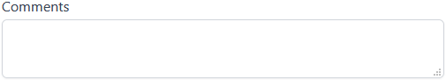

<br />
<br />

## LoginError
A failed message component.

#### Importing LoginError
```tsx
import LoginError from "components/LoginError/LoginError";
```

#### Using LoginError
```tsx
<LoginError />
```
<br />
<br />

## Menu
A menu component for mobile and tablet screen sizes.

The route for the menu page works by default, as does the back button.

#### Importing Menu
```tsx
import Menu from "components/Menu/Menu";
```

#### Using 
```tsx
<Menu>
  //
  // Slot
  //
</Menu>
```
<br />
<br />

## ModelTable
A table component for your records.

#### Importing ModelTable
```tsx
import ModelTable from "components/ModelTable/ModelTable";
```

#### Using ModelTable
```tsx
<ModelTable {...ModelTableProps} />
```
<br />

#### ModelTableProp

**checkboxClick:** `Function` `Optional` \
Action when the row checkbox is clicked
<br />

**columnOrder:** `Array` `Optional` \
Column order for each row
<br />

**excludeTimestamps:** `Boolean` `Optional` \
Excludes timestamps
<br />

**headingLabels:** `HeadingLabel` `Array` `Optional` \
An array of labels to be used as column titles
<br />

**rows:** `ModelRow` `Array` `Optional` \
An array of records
<br />

#### ModelRowProps

**id:** `String | null` `Required` \
The record Id
<br />

**description:** `String | null` `Optional` \
The record description
<br />

**icon:** `String | null` `Optional` \
A record icon field
<br />

**image:** `String | null` `Optional` \
A record image
<br />

**insertedAt:** `String | null` `Optional` \
The time the record was created at
<br />

**subtitle:** `String | null` `Optional` \
The record subtitle
<br />

**title:** `String | null` `Optional` \
The record title
<br />

**updatedAt:** `String | null` `Optional` \
The time the record was last updated at
<br />

#### HeadingLabelProps

**key:** `String` `Required` \
The column title key
<br />

**label:** `String` `Required` \
The column title label


<br />
<br />

## Pagination
A sticky pagination component for model pages.

#### Importing Pagination
```tsx
import Pagination from "components/Pagination/Pagination";
```

#### Using Pagination
```tsx
<Pagination
  count={data...}
  countBefore={data...}
  goToFirst={goToFirst}
  goToLast={goToLast}
  limit={100}
  next={next}
  prev={prev}
/>
```
<br />

#### PaginationProps

**count:** `Number` `Required` \
The amount of records you currently have loaded
<br />

**countBefore:** `Number` `Required` \
The amount of records prior to loading the current record set
<br />

**goToFirst:** `Function` `Required` \
Go to the first page of the records
<br />

**goToLast:** `Function` `Required` \
Go to the last page of the records
<br />

**limit:** `Number` `Required` \
How many records are shown per page
<br />

**next:** `Function` `Required` \
Go to the next page of records
<br />

**prev:** `Function` `Required` \
Go to the previous page of records

#### Demo

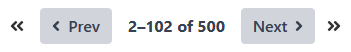

<br />
<br />

## Pill
An active filter pill component.

#### Importing Pill
```tsx
import Pill from "components/Pill/Pill";
```

#### Using Pill
```tsx
<Pill 
  icon={faTag}
  label="To do"
  remove={() => {}}
>
  //
  // Slot
  //  
</Pill>
```
<br />

#### PillProps

**icon:** `FontAwesomeIcon` `Object` `Optional` \
A FontAwesomeIcon icon
<br/>

**iconColor:** `String` `Optional` \
A custom icon color that is passed to a style tag
<br/>

**label:** `String` `Optional` \
The component text field
<br/>

**remove:** `Function` `Optional` \
A function that actives the X icon, and removes the pill components

#### Demo

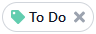

<br />
<br />

## Search
A search bar component.

#### Importing Search
```tsx
import Search from "components/Search/Search";
```

#### Using Search
```tsx
<Search 
  change={() => {}}
  focusOnMount={false}
  placeholder="Search..."
  val={''}
/>
```
<br />

#### SearchProps

**change:** `Function` `Required` \
The action that happens when a search value is input
<br/>

**focusOnMount:** `Boolean` `Required` \
Focuses the search input on page load
<br/>

**placeholder:** `String` `Optional` \
Search bar placeholder text
<br/>

**val:** `Function` `Required` \
Default search value

#### Demo

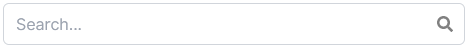

<br />
<br />

## SidebarNavItem
A navigation item component. We use this by default in our themes in the [AdminSidebar](/ui/components.html#adminsidebar) and [Menu](/ui/components.html#menu) components. The component can be rendered as a `<button>` or a `<router-link>` depending on the props passed to it.

#### Importing SidebarNavItem
```tsx
import SidebarNavItem from "components/SidebarNavItem/SidebarNavItem";
```

#### Using SidebarNavItem
```tsx
<SidebarNavItem>
  //
  // Slot
  //
</SidebarNavItem>
```
<br />

#### SidebarNavItemProps

**click:** `Function` `Optional` \
The action that happens on click, and this makes the component a `<button>`
<br/>

**icon:** `FontAwesomeIcon` `Object` `Optional` \
A FontAwesomeIcon icon
<br/>

**id:** `String` `Optional` \
The component Id
<br/>

**isChild:** `Boolean` `Optional` \
Styles the component as a sub-nav item
<br/>

**label:** `String` `Optional` \
The component text field
<br/>

**notification:** `Number` `Optional` \
An option to pass down notifications
<br/>

**to:** `RouteLocationRaw` `Optional` \
The route the component should link to, and this makes the component a `<router-link>`

#### Demo

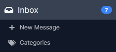

<br />
<br />

## StateEmpty
An empty state component, to be paired with the [ModelTable](/ui/components.html#modeltable) component when there are no search results. If no props are passed down, the component will use it's default icon and label.

#### Importing StateEmpty
```tsx
import StateEmpty from "components/StateEmpty/StateEmpty";
```

#### Using StateEmpty
```tsx
<StateEmpty />
```
<br/>

**icon:** `FontAwesomeIcon` `Object` `Optional` \
A FontAwesomeIcon icon
<br/>

**label:** `String` `Optional` \
The component text field

#### Demo

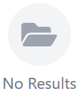

<br />
<br />

## StateLoading
An animated loading component.

#### Importing StateLoading
```tsx
import StateLoading from "components/StateLoading/StateLoading";
```

#### Using StateLoading
```tsx
<StateLoading />
```

#### Demo


<br />
<br />

<!-- ## Tabs
A tab list component.

#### Importing Tabs
```tsx
import Tabs from "components/Tabs/Tabs";
```

#### Using Tabs
```tsx
<Tabs>
  //
  // Slot
  //
</Tabs>
```
<br />
<br /> -->

## Wrapper
A wrapper component for consistent horizontal padding.

#### Importing Wrapper
```tsx
import Wrapper from "components/Wrapper/Wrapper";
```

#### Using Wrapper
```tsx
<Wrapper>
  //
  // Slot
  //
</Wrapper>
```